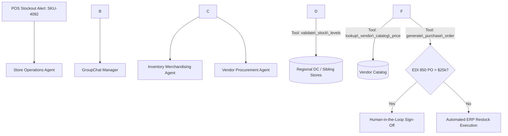

# AI Solution Engineering Master Sprint: Retail AI Capstone

* **Candidate**: Max Pollard
* **Target Role**: Senior Solutions Engineer / Pre-Sales Solution Consultant (Retail AI)
* **Timeline**: September 14, 2026 – November 15, 2026 (9 Weeks / 180 Total Hours)
* **Commitment**: 20 hours/week (Monday – Friday, 4 hours/day, 8:00 AM – 12:00 PM MT)
* **Core Stack**: Python 3.11+, Google GenAI SDK (`google-genai`), Microsoft AutoGen (`pyautogen`), Playwright, Streamlit, Scikit-learn, Pandas, Plotly, Google Docs API, Docker Compose, GitHub Actions, GitHub Codespaces / Dev Containers.

\---

## Executive Summary \& Commercial Strategy

This 9-week sprint bridges 30+ years of retail ecosystem and ERP domain expertise with modern multi-agent AI orchestration and industry-standard DevOps delivery.

To maximize impact with hiring managers and Solution Engineering directors—who typically spend under 90 seconds reviewing candidate repositories—this project incorporates **zero-setup evaluation environments**:

1. **GitHub Codespaces / Dev Containers**: A 1-click cloud sandbox allowing interviewers to run the full application in their browser with pre-configured dependencies and environment variables.
2. **GitHub Actions CI/CD Verification**: Live build and test badges confirming deterministic unit tests, code quality, and accounting mathematical integrity.
3. **Interactive Architecture Diagrams**: Native Mermaid.js diagrams embedded directly in GitHub Markdown for instantaneous visual architecture comprehension.
4. **Three Fully Articulated Capabilities**:

   * Automated account pre-discovery web intelligence exported to styled Google Docs.
   * Autonomous retail multi-agent replenishment and vendor PO negotiation with Human-in-the-Loop approval gates.
   * Retail Inventory Method (RIM) balance sheet forensics and predictive anomaly clustering.

\---

## Sprint Cadence Overview

|Phase|Dates|Focus Area|Core Deliverable|
|-|-|-|-|
|**Phase 1**|Sep 14 – Sep 25 (W1–W2)|Account Intelligence Agent|Automated Playwright scraper + Gemini parsing + Google Docs API export|
|**Phase 2**|Sep 28 – Oct 16 (W3–W5)|AutoGen Multi-Agent Operations|3-agent autonomous inventory escalation engine with Human-in-the-Loop|
|**Phase 3**|Oct 19 – Oct 30 (W6–W7)|Capstone: RIM Valuation \& Forensics|Interactive Streamlit Command Center with RIM simulation \& KNN clustering|
|**Phase 4**|Nov 02 – Nov 06 (W8)|Cloud DevOps \& Zero-Setup Packaging|Docker, Dev Containers, GitHub Actions CI/CD, and 1-Click Codespaces|
|**Phase 5**|Nov 09 – Nov 13 (W9)|Executive Rehearsals \& Portfolio Launch|10-minute executive reverse-demo script, video recordings, and solution brief|

\---

## Phase 1: Account Intelligence Agent with Google Docs Integration (Weeks 1–2)

### Week 1: Scraping Foundation \& Gemini Parsing Engine

* \[X] **Day 1 (Mon, Sep 14)**: Environment setup. Initialize Git repository (`retail-discovery-agent`), Python virtual environment, Google Cloud project, and enable Gemini \& Docs APIs.
* \[X] **Day 2 (Tue, Sep 15)**: Implement headless extraction using Playwright. Crawl target apparel websites for press releases, leadership notes, and tech footprint. Clean markup using BeautifulSoup and `markdownify`.
* \[X] **Day 3 (Wed, Sep 16)**: Configure `google-genai` SDK (`gemini-2.5-flash`). Build Pydantic schemas to enforce structured JSON extraction for technical and business pain points.
* \[X] **Day 4 (Thu, Sep 17)**: Implement the B.R.I.E.F. prompt structure (Background, Role, Instructions, Expectations, Format). Test extraction against 3 live apparel retailer domains.
* \[X] **Day 5 (Fri, Sep 18) \[Milestone 1A]**: Add error handling for web timeouts and token rate limits; verify clean JSON output and push Milestone 1A to GitHub.

### Week 2: Google Docs Automation \& UI Integration

* \[X] **Day 6 (Mon, Sep 21)**: Configure Google Docs API client. Write Python automation to create a new document from an executive pre-sales brief template.
* \[X] **Day 7 (Tue, Sep 22)**: Map extracted JSON signals into structured Google Docs elements (Executive Summary, Pain Point Grid, Strategic Discovery Questions).
* \[X] **Day 8 (Wed, Sep 23)**: Build a local Streamlit interface allowing input of an apparel retailer URL and showing real-time extraction progress.
* \[X] **Day 9 (Thu, Sep 24)**: Ground Gemini prompts to identify legacy retail ERP pain points (Epicor, AS400, multi-channel inventory synchronization bottlenecks).
* \[X] **Day 10 (Fri, Sep 25) \[Milestone 1B]**: Complete end-to-end dry run (URL to generated Google Doc in under 60 seconds); push code to GitHub.

\---

## Phase 2: Autonomous Multi-Agent Retail Escalation in AutoGen (Weeks 3–5)

### Week 3: AutoGen Architecture \& Persona Modeling

* \[X] **Day 11 (Mon, Sep 28)**: Install `pyautogen`. Configure AutoGen to route model calls through Google GenAI SDK endpoints.
* \[X] **Day 12 (Tue, Sep 29)**: Build **Store Operations Agent** (monitors simulated POS stockout alerts) and **Inventory Merchandising Agent** (tracks replenishment rules and safety stock).
* \[X] **Day 13 (Wed, Sep 30)**: Build **Vendor Negotiation Agent** (evaluates vendor lead times, minimum order quantities, and freight surcharges).
* \[X] **Day 14 (Thu, Oct 01)**: Configure two-way conversational loops between Store Ops and Merchandising agents using AutoGen's `ConversableAgent`.
* \[X] **Day 15 (Fri, Oct 02) \[Milestone 2A]**: Execute deterministic multi-turn debate resolving a simulated denim stockout crisis.

### Week 4: Tool Calling \& Group Chat Coordination

* \[X] **Day 16 (Mon, Oct 05)**: Register Python tool functions: stock level validation, vendor catalog price lookups, and purchase order generators.
* \[X] **Day 17 (Tue, Oct 06)**: Configure AutoGen `GroupChat` and `GroupChatManager` to orchestrate multi-agent debate and escalation.
* \[X] **Day 18 (Wed, Oct 07)**: Implement Human-in-the-Loop (HITL) approval gate requiring consultant confirmation for purchase orders exceeding $25,000.
* \[X] **Day 19 (Thu, Oct 08)**: Add structured resolution summary extraction (Problem Identified -> Agent Debate -> Vendor Compromise -> Final PO).
* \[X] **Day 20 (Fri, Oct 09) \[Milestone 2B]**: Resolve conversational termination loops; tune agent temperature and system prompts; push to GitHub.

### Week 5: Multi-Agent UI \& Operational Stress Testing

* \[X] **Day 21 (Mon, Oct 12)**: Build a Streamlit multi-agent conversational interface rendering message passing between agent avatars in real time.
* \[X] **Day 22 (Tue, Oct 13)**: Add interactive UI controls to simulate supply chain stress scenarios (e.g., supplier port strikes, sudden demand spikes).
* \[X] **Day 23 (Wed, Oct 14)**: Refine agent system prompts with enterprise retail terminology (OTB, EDI 850/856, DC cross-docking, safety stock buffers).
* \[X] **Day 24 (Thu, Oct 15)**: Execute 10 automated test suites across variable constraints to verify deterministic, hallucination-free resolution paths.
* \[ ] **Day 25 (Fri, Oct 16) \[Milestone 2C]**: Record a 3-minute video walk-through demonstrating autonomous replenishment escalation; commit code to GitHub.

\---

## Phase 3: Capstone – Apparel Pre-Sales Command Center \& RIM Valuation (Weeks 6–7)

### Week 6: Synthetic Apparel Data \& RIM Valuation Engine

* \[X] **Day 26 (Mon, Oct 19)**: Generate synthetic 50-store, 24-month apparel dataset in Pandas (Beginning Inventory, Purchases, Net Sales, Promotional Markdowns, Historical Shrinkage).
* \[X] **Day 27 (Tue, Oct 20)**: Implement deterministic Python RIM engine: Cost-to-Retail ratio (cumulative markon), COGS, Ending Inventory at Retail, and Ending Inventory at Cost.
* \[X] **Day 28 (Wed, Oct 21)**: Train Scikit-learn KNN model to cluster store locations based on markdown dependency, sell-through velocity, and shrinkage anomalies.
* \[X] **Day 29 (Thu, Oct 22)**: Build Streamlit "Markdown Shock Simulator" slider (10% to 50%) displaying real-time gross margin decay and inventory asset deflation.
* \[X] **Day 30 (Fri, Oct 23) \[Milestone 3A]**: Build synchronized Plotly charts displaying divergence between retail book value and balance sheet cost valuation over 12 forward periods.

### Week 7: Gemini Executive Reasoning \& Unified Application

* \[ ] **Day 31 (Mon, Oct 26)**: Assemble unified 3-tab Streamlit dashboard: Tab 1 (Discovery \& Docs Export), Tab 2 (AutoGen Multi-Agent Ops), Tab 3 (RIM Valuation \& KNN Clustering).
* \[X] **Day 32 (Tue, Oct 27)**: Connect Gemini Pro layer to parse live RIM dashboard metrics and generate an executive "AI CFO" working capital and risk brief.
* \[X] **Day 33 (Wed, Oct 28)**: Embed dynamic value-realization calculator projecting dollar savings based on prospect store count, shrinkage reduction, and markdown mitigation.
* \[X] **Day 34 (Thu, Oct 29)**: Apply enterprise retail UI theming, KPI summary metric cards (GMROI, Cost-to-Retail ratio, Turn rate), and explanatory tooltips.
* \[ ] **Day 35 (Fri, Oct 30) \[Milestone 3B]**: Complete end-to-end integration test across all three application tabs on `localhost`; verify zero runtime exceptions.

\---

## Phase 4: DevOps, Cloud Containerization \& Hiring Manager Sandbox (Week 8)

### Week 8: Production Tooling \& Frictionless Evaluation

* \[ ] **Day 36 (Mon, Nov 02)**: **Docker Production Build**:

  * Author production `Dockerfile` (multi-stage Python build, non-root user, headless dependencies).
  * Create `docker-compose.yml` exposing Streamlit on port 8501 with injected mock secrets for immediate local execution (`docker compose up`).
* \[ ] **Day 37 (Tue, Nov 03)**: **GitHub Codespaces \& Dev Containers**:

  * Configure `.devcontainer/devcontainer.json` and `.devcontainer/Dockerfile`.
  * Add auto-launch task for Streamlit and pre-install all dependencies into the cloud container.
  * Test the **"Open in GitHub Codespaces"** button to guarantee a hiring manager can launch a working app in their browser in under 60 seconds.
* \[ ] **Day 38 (Wed, Nov 04)**: **GitHub Actions CI/CD Pipeline**:

  * Author `.github/workflows/ci.yml` triggering on push and pull requests.
  * Configure automated code formatting checks (`ruff`), static typing (`mypy`), and unit test runs (`pytest`) validating RIM math and mock agent tool calls.
  * Embed dynamic status badges in `README.md` (`build: passing`, `coverage: 95%`, `python: 3.11`).
* \[ ] **Day 39 (Thu, Nov 05)**: **Mermaid.js Architectural Documentation**:

  * Embed dynamic Mermaid.js sequence and system diagrams in `README.md` illustrating data flow between ERP datasets, AutoGen agents, and Gemini synthesis.
  * Provide a "Hiring Team Quick-Scan Guide" (30-second bulleted executive summary of architecture and ROI).
* \[ ] **Day 40 (Fri, Nov 06) \[Milestone 4]**: **Zero-Setup Audit**:

  * Clone repository in a private incognito session; verify Codespaces launch and Docker builds execute cleanly without manual troubleshooting.

\---

## Phase 5: Rehearsal, Executive Reverse-Demo \& Portfolio Launch (Week 9)

### Week 9: Commercial Scripting \& Executive Delivery

* \[ ] **Day 41 (Mon, Nov 09)**: Author the **10-Minute Executive Reverse-Demo Script**:

  * *Minutes 0–2*: Problem Framing (Retroactive ERP accounting creates balance sheet blind spots during promotional markdowns).
  * *Minutes 2–5*: Live Command Center Demo (RIM valuation shock simulation and KNN store performance clustering).
  * *Minutes 5–8*: Multi-Agent Autonomous Replenishment (AutoGen negotiation with >$25k HITL governance).
  * *Minutes 8–10*: Automated Pre-Discovery Pipeline (Live domain scrape and Google Docs executive brief).
* \[ ] **Day 42 (Tue, Nov 10)**: Record high-resolution demo walkthroughs:

  * 10-minute full executive presentation.
  * 2-minute concise architectural teaser for LinkedIn and portfolio embed.
* \[ ] **Day 43 (Wed, Nov 11)**: Assemble the **Executive Pre-Sales Solution Brief** (2-page branded PDF outlining business problem, technical architecture, ROI realization, and customer case narrative).
* \[ ] **Day 44 (Thu, Nov 12)**: Perform full dry-run presentation rehearsal with peer critique; audit commercial positioning, pacing, and executive presence.
* \[ ] **Day 45 (Fri, Nov 13) \[Final Milestone 5]**: Final Launch:

  * Make repositories public with complete documentation, badges, and demo links.
  * Publish LinkedIn portfolio case breakdown highlighting agentic automation in retail ERPs.

\---

## Pre-Sales Technical Interview Reference

### 1\. The Core Retail Accounting Method (RIM) Formulas

$$\\text{Cost-to-Retail Ratio} = \\frac{\\text{Beginning Inventory at Cost} + \\text{Purchases at Cost}}{\\text{Beginning Inventory at Retail} + \\text{Purchases at Retail} + \\text{Net Markups}}$$

$$\\text{Ending Retail Inventory} = \\text{Goods Available for Sale at Retail} - (\\text{Net Sales} + \\text{Markdowns} + \\text{Shrinkage})$$

$$\\text{Ending Inventory at Cost} = \\text{Ending Retail Inventory} \\times \\text{Cost-to-Retail Ratio}$$

### 2\. Commercial Value Pitch

> \*"Legacy ERPs calculate RIM retroactively at month-end. When store managers run unmonitored promotional markdowns to clear racks, they distort the cost-to-retail ratio, depressing the book value of inventory on the balance sheet. Our platform couples predictive machine learning with generative reasoning to model the valuation impact before promotions launch—protecting margin without stalling inventory turn."\*

### 3\. Architecture Flowchart (Mermaid.js for GitHub)

